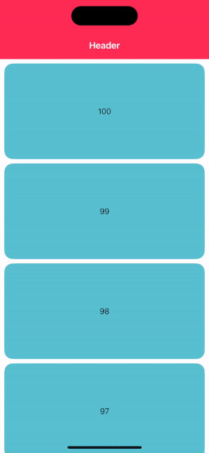

# ScrollHeader

ScrollHeader for SwiftUI.

## Gifs



## Usage

```swift
ScrollHeaderView(
    header: {
        // ...
    },
    content: {
        // ...
    }
)
```

## Requirements

- iOS 15.0 +
- Xcode 15.0 +
- [SwiftUI](https://developer.apple.com/xcode/swiftui/)

## License

- ScrollHeader is distributed under the MIT License.
